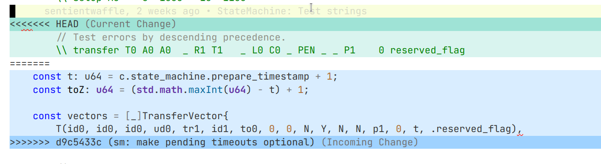

# Git: From Zero to Hero - Navigating Merge Conflicts

In the collaborative world of Git and open-source development, understanding how to manage merge conflicts is a crucial skill. A **merge conflict** arises when multiple contributors attempt to modify the same piece of code simultaneously, and Git needs assistance in reconciling the conflicting changes. The `CONFLICT.md` guide is your compass through the second part of our workshop, where you will actively engage with the challenges and resolutions involved in collaborative coding. Learn how to identify, address, and gracefully resolve merge conflicts, ensuring a harmonious integration of diverse contributions in the shared repository. Embrace the collaborative spirit as we delve into the intricacies of managing conflicts and fostering a smooth development process for the entire team.

> [!TIP]
> Merge conflicts occur when multiple contributors modify the same part of the code simultaneously.

## Table of Contents

- [Git: From Zero to Hero - Navigating Merge Conflicts](#git-from-zero-to-hero---navigating-merge-conflicts)
  - [Table of Contents](#table-of-contents)
  - [Getting Started](#getting-started)
    - [Add collaborators](#add-collaborators)
    - [Complete the code](#complete-the-code)
    - [Push you code to your colleague's repository](#push-you-code-to-your-colleagues-repository)
    - [Push you code to your repository](#push-you-code-to-your-repository)
    - [Fetch remote and merge conflict](#fetch-remote-and-merge-conflict)


## Getting Started

In this second section of the workshop, you will experience (*the pain of*) how to merge a conflict. Choose your teammate, your colleague, and proceed in this section.

### Add collaborators

To add you colleague as collaborator, you need to open you personal repository on GitHub, then go to:

```txt
Settings -> Collaborators -> Add People -> Search by username
```

> [!NOTE]
> Ask your colleague for her or his username.

At this point, your colleagues can push code to your repository. Hopefully, they also completed the process of adding you as a collaborator and you can push on her or his repository too.

### Complete the code

In [`conflict`](./conflict/) you should find a `main.py` file. This file is intended to be completed by you and your teammate into two different ways. Here's a suggested workflow:

1. Read the comment.
2. Agree with you colleague and choose two different algorithms to be implemented.
3. Delete the comment (and just the comment).
4. Spend about 10 to 15 minutes to implement the code you chose.

> [!NOTE]
> Remember to checkout the main branch to complete this exercise: `git checkout main`

### Push you code to your colleague's repository

At this point, you can push your code to your colleague repository. However, to do so, you first need to add their repository as your **remote**. 

```bash
git remote add <remote-name> https://github.com/<colleague-username>/GitMasterclass.git
```

> [!TIP]
> You can run `git remote -v` to check all remotes linked to your local repository.

You can now push your code to your colleague's repository by referencing to this remote.

```bash
git add <modified-file>
git commit -m "feat: my version of the code"
git push <remote-name> main
```

> [!NOTE]
> Your colleague will do the same on your repository.

### Push you code to your repository

Once you colleague has pushed her or his code to your repository, you can try to push your code to your repository.

> [!TIP]
> Your repository is referenced by the `origin` remote.

You can run:

```bash
git push origin main
```

But you will see that the operation fails to complete. Specifically, you will get the following error message:

```txt
To https://github.com/<your-username>/GitMasterclass.git
 ! [rejected]    	main -> main (fetch first)
error: failed to push some refs to 'https://github.com/<your-username>/GitMasterclass.git'
hint: Updates were rejected because the remote contains work that you do
hint: not have locally. This is usually caused by another repository pushing
hint: to the same ref. You may want to first integrate the remote changes
hint: (e.g., 'git pull ...') before pushing again.
hint: See the 'Note about fast-forwards' in 'git push --help' for details.
```

This is expected. **The remote contains work that you do not have locally**. You need first to fetch that work.

### Fetch remote and merge conflict

You can now run a `git pull`, as suggested by the previous issue. This operation will try to download the remote content into your local copy. However, the remote repository contains the algorithm of your colleague, while your local copy contains your algorithm. **This is a conflict!**

Don't worry, it is time to embrace your patience and carefully try to merge the two piece of code. 

> [!TIP]
> In real-case scenario, you probably need to meticulously select the snippets that you want to keep and the one that you want to overwrite on the remote.

In our case, to simplify the process, we simply ask you to keep the code of your colleague and overwrite your code entirely. You can do it with your preferred code editor. Here's a picture of a merging conflict with Visual Studio Code.



Specifically, you will see:

- In green, your **current change**. This is the code you have written.
- In blu, the **incoming change**. This is the code that you are trying to copy from the repository. 

Choose the one you want to keep, in this case, the blue one, and solve the conflict. 

> [!IMPORTANT]
> You are now aligned with the remote.