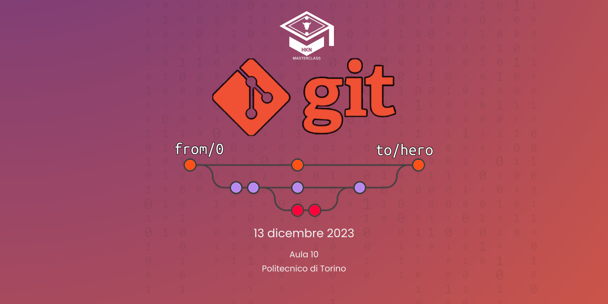
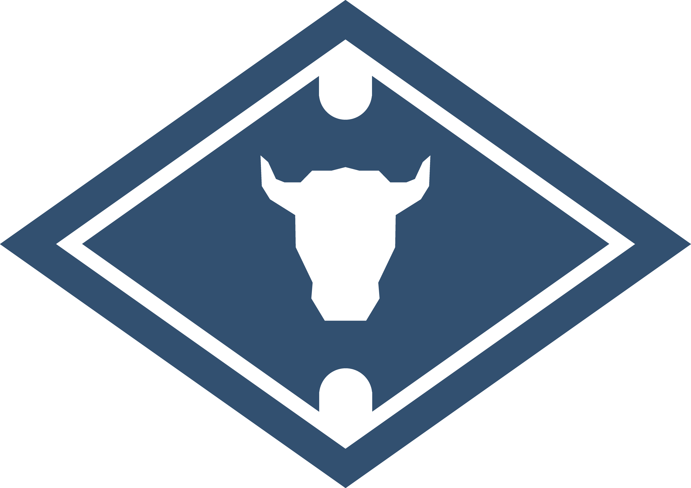
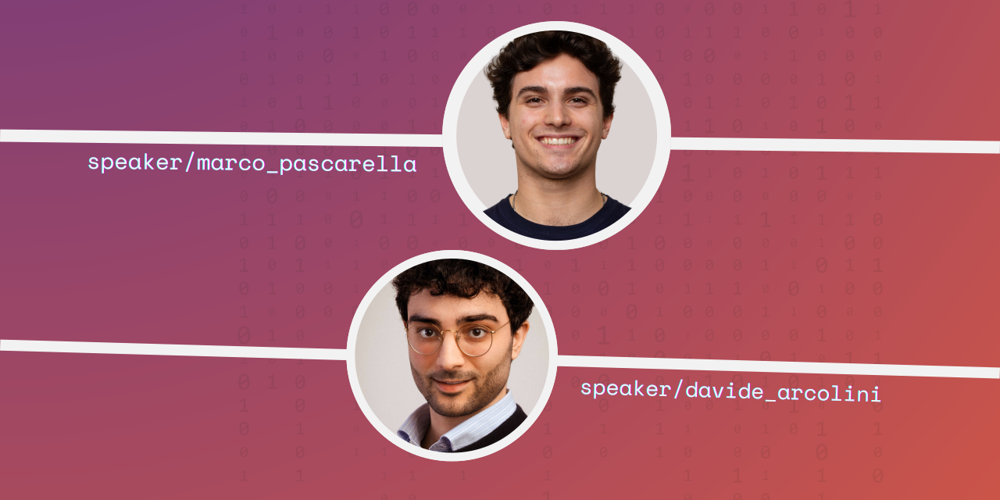

<h1 align="center">👨🏻‍🏫 HKN Masterclass 👨🏻‍🏫</h1>
<h2 align="center">Git: From Zero to Hero 🚀   <small>Consigli e pratiche ottimali per lavorare in team</small> </h2>

## 👋 Welcome!

Welcome to the second 2023 Edition of the <b>HKN Masterclass</b>!

**"*Git: From Zero to Hero - Consigli e pratiche ottimali per lavorare in team*"** is the second 2023 Edition of the HKN Masterclass focusing on the most popular **Version Control System** adopted worldwide by companies and developer teams: **Git**. 

In this hands-on workshop, you'll navigate a comprehensive simulation of the developer experience when contributing to an open-source project. Learn to master essential Git commands and leverage GitHub functionalities to open new issues, address and commit your code changes, and finalize the process by initiating pull requests to propose your valuable contributions.

By the conclusion of this workshop:

- You will have created your [**GitHub**](https://github.com) profiles, if you do not already have one.
- You will be able to **expose a copy of this repository** on your profile, offering recruiters and employers a glimpse into your achievements on GitHub.
- Talking about achievements... Hopefully you will have put enough effort in this workshop to get the cool [**Pull Shark achievement**](https://github.com/orgs/community/discussions/20357).
- Acquire proficiency in understanding and employing **essential Git commands**.
- Familiarize yourself with the most adopted **Git strategies** employed by developers worldwide.
- Learn the intricacies of **contributing to open-source projects** and collaborating seamlessly with colleagues in your repository.

## ⚡️ Who we are

We are **HKN** 🚀.

  

IEEE-HKN recognizes excellence among peers, encourages individual growth through education, and professional commitment in associative activities. The pillars on which our activities are based are:

- Our skills are put to the service of the student community through the organization of study groups and masterclasses.
- The personal and professional growth we aim for with our activities is achieved through meetings with industry professionals and our network of alumni.
- Within the community, members manage various team-building activities aimed at ensuring a respectful, inclusive, and motivating atmosphere.
- Our chapter is part of an international network that brings together over 200 IEEE-HKN chapters, allowing members to network.

## 👥 Speakers
The theoretical parts on the Version Control System and Git presented in this Masterclass has been presented by:

- **Marco Pascarella** (M.Sc. in Communications Engineering) has covered the introduction to the Software Version Control and the basics of Git and GitHub.
- **Davide Arcolini** (M.Sc. in Computer Engineering) has covered the introduction to Git Branching concepts and the strategies for cooperative development and contribution to open-source projects.

## How does it work?

This workshop will be divided into two sections:

1. **Contribution to open-source project**. 
2. **Managing conflicts between collaborators**.
   
### Contributing to open-source projects
In the first section of the workshop, you simulate the process of opening a PR (i.e. a Pull Request) to propose your code changes to the maintainers.

Specifically, you need to find bugs in the code of this repository, and for each of those bugs, open a new issue. The issue is then evaluated by the internal collaborators of the project (i.e. us!): this allows to confirm or reject the issue based on the specific characteristics that developers have in mind for the project. For instance, an issue you opened and that you referred to some piece of code not doing the work as *you* may expected, instead, may be a feature that developers had in mind in the first place. It is important to communicate with maintainers of the repository to understand what code should be changed and how.

Once the internal collaborators evaluated you issue, the same issue is assigned to you. It's your moment to show us you code's abilities. Fork the repo, clone the repo, fix the code, test the code, commit the code. Are you ready? If yes, push your changes to your remote repository and finally open a Pull Request. Your code will be evaluated and, hopefully, accepted in the original source code. Great! You have contributed to this project and you have achieved a merge on your first PR. Now, do that again. If you'll do that twice, you may achieve the some cool achievement from GitHub.

Now. This may seem a bit overwhelming. Don't worry, we have created a `CONTRIBUTING.md` that explains everything you need to do with more details. Refer to it if you ever feel lost in this process.

> [!NOTE]
> You can find the file [here](./CONTRIBUTING.md).

### Managing conflicts between collaborators

Managing conflicts between collaborators is never easy. Even less if those are Git conflicts! When people from your team work together at the same source code, you may notice that keeping track of everything is definitely complicated. However, Git is here to help.

In this section of the workshop you will share your repository with your colleagues and you will cooperatively work at the source code. However, at some point in time, your colleague will make changes to the remote code you were also working on. Don't worry. It happens. You now need to merge his version into yours and manage the conflicts. 

Again. This may seem a bit overwhelming. Don't worry, we have created a `CONFLICT.md` that explains everything you need to do with more details. Refer to it if you ever feel lost in this process.

> [!NOTE]
> You can find the file [here](./CONFLICT.md).